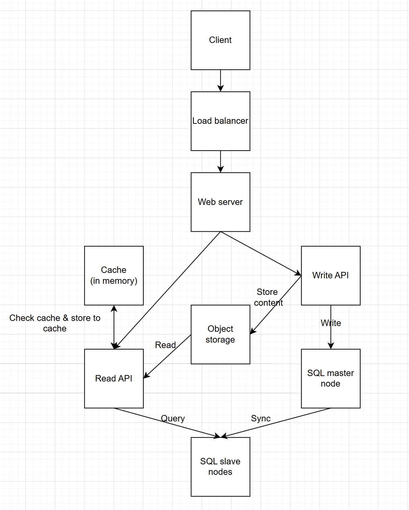

# Design pastebin service

## Target audience, key matrics
* **Audience**: developers (80%), office staff (20%)
* **Needs**: 
    * Input a piece of text and receive a generated random link
        * Users can set an expiration date
        * Users cannot edit the content after it is stored (out of scope)
    * Users use the generated random link to view the saved content
        * Expired content cannot be viewed
    * Not covered: User accounts (users are anonymous and no authentication is required)

* **Metrics (assumptions)**:

| Metric    | Description | Expectation |
| -------- | ------- | ---- |
| DAU  | unique users per day    | 1000 |
| Document |  number of pastes created per day    | 2000 |
| Avg open    |  opens per user per day   | 10 |

## Technical requirements
### Requests per second (RPS)

Assume `busy_factor` at peak is 10.  

We have 
$$
RPS = \left( \frac{\text{Avg\_open} \cdot \text{DAU} + \text{created\_document\_num}}{\text{seconds\_per\_day}} \right) \cdot \text{busy\_factor} = \left( \frac{10 \cdot 1000 + 2000}{86400} \right) \cdot 10 \approx 1.4
$$

=> Expect 1.4 RPS

### Storage
**Size per paste**:
* a paste content: 3KB
* shortlink: 7 bytes (use a..z, A..Z, 0..9 we have available 62^7 shortlink)
* expiration_time: 12 bytes
* created_at: 12 bytes
* internal_path: 255 bytes (use to get content inside the server)  
**=>** Total: 3.3KB

**Size per year**: 3.3KB/paste * 12 months/year * 30 days/month * 2000 = 2376000KB ≈ 2.4GB

### Network
* **Input**: ≈ 3-3.1KB (a POST request) or 7-20 bytes (a GET request with generated shortlink)
* **Output**: ≈ 3KB for paste content + HTTP headers
* **Total**: Assume 3.1 KB per POST request (input), 20 bytes per GET request (input) and 3.1KB per response (output). We have $3.1KB * 2000 + 20B * (2000 + 10000) + 3.1KB * 10000 = 37440000B ≈ 37MB$ per day. Equivalent to 433B per second.

## Architecture

The server will have two main RESTful APIs:
* Read API
* Write API

A user request will go through a load balancer (e.g., Nginx) before reaching the web server.

A write request will be routed to the Write API. The paste content will be stored in object storage, and a new record will be inserted into the SQL master node. After that, the data will be synchronized to the slave nodes.  
A master-slave model is used to reduce the load on a single SQL node, which could become a bottleneck.

A read request will be handled by the Read API. The Read API server first checks if the data is cached. If there is a cache hit, the data is returned immediately without querying the SQL database. Otherwise, it queries the database to retrieve the object storage path, stores the result in the cache, and then responds to the user.
Retrieving data from an in-memory cache is significantly faster than querying the database.

### Technology justification

| Technology    | Reason for choice |
| -------- | ------- |
| MySQL  | ACID transactions, setting up master/slave is not too complex   |
| Redis |  low-latency read and write operations   |
| S3 (or S3-compatible storage)    | affordable for storing object|